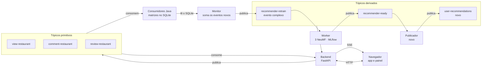
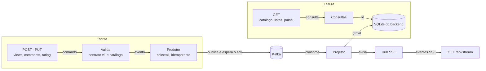
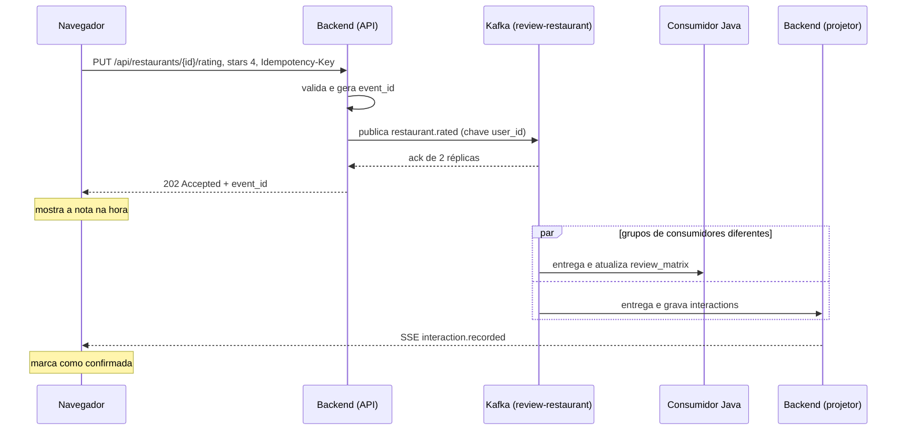
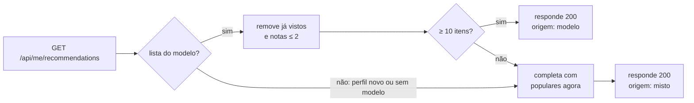

# Backend do TasteMatch

O backend é a porta de entrada do app. Ele transforma cada ação do usuário em um evento no Kafka, monta as telas com eventos que voltam do Kafka e avisa o navegador quando algo muda. É uma API FastAPI que só conversa com o navegador e com o Kafka.

## Início rápido

Tudo sobe com um comando na raiz do repositório. O único pré-requisito é ter os dois JSON do Yelp em `recommender_training/data/yelp/` (veja o [README da raiz](../README.md)).

```bash
docker compose up --build -d
curl -s localhost:8000/api/health
```

O app, que usa esta API, fica em [http://localhost:3000](http://localhost:3000) (veja o [frontend](../frontend/README.md)). A documentação interativa da API fica em [http://localhost:8000/docs](http://localhost:8000/docs). Para entrar com um perfil do Yelp e avaliar um restaurante pela linha de comando:

```bash
USER_ID=$(curl -s localhost:8000/api/users | python3 -c "import json,sys; print(json.load(sys.stdin)[0]['id'])")
RESTAURANT_ID=$(curl -s "localhost:8000/api/restaurants?limit=1" | python3 -c "import json,sys; print(json.load(sys.stdin)['items'][0]['id'])")
curl -s -c /tmp/tm-cookie -X POST localhost:8000/api/session \
  -H 'Content-Type: application/json' -d "{\"user_id\": \"$USER_ID\"}"
curl -s -b /tmp/tm-cookie -X PUT "localhost:8000/api/restaurants/$RESTAURANT_ID/rating" \
  -H 'Content-Type: application/json' -H 'Idempotency-Key: demo-rating-0001' -d '{"stars": 5}'
```

A resposta `202` traz `event_id`, partição e offset. O evento aparece no Kafka UI ([http://localhost:8085](http://localhost:8085)), em `kafka/data/yelp/reviews.db` e no histórico do perfil. Para ver a confirmação chegar em tempo real, deixe um stream aberto em outro terminal antes de avaliar:

```bash
curl -N -b /tmp/tm-cookie localhost:8000/api/stream     # sem -b, recebe só o resumo de atividade
curl -s -b /tmp/tm-cookie localhost:8000/api/me/history
curl -s -b /tmp/tm-cookie localhost:8000/api/me/recommendations
```

Para testar um gosto sem abrir restaurante por restaurante, o simulador publica, para cada restaurante de uma categoria, uma visualização, uma nota 4 ou 5 e um comentário positivo (em inglês, porque o treino só lê sentimento em inglês). Os eventos seguem o mesmo caminho das ações do app:

```bash
curl -s -b /tmp/tm-cookie -X POST localhost:8000/api/me/simulate \
  -H 'Content-Type: application/json' -d '{"category": "Pizza", "restaurants": 6}'
curl -s -b /tmp/tm-cookie localhost:8000/api/me/categories
```

O painel do ciclo de treino lê `GET /api/dashboard`. Para pedir um treino sem esperar os 300 eventos novos, use o atalho:

```bash
curl -s localhost:8000/api/dashboard
curl -s -X POST localhost:8000/api/admin/retrain
```

### Desenvolvimento com uv

O projeto usa `pyproject.toml`, `uv.lock` e `.python-version` (Python 3.12), como o `recommender_training`.

```bash
cd backend
uv sync --locked
uv run pytest
uv run taste-match-api   # usa o Kafka da raiz em localhost:29192 e a amostra em ../recommender_training/runtime/sample
```

O teste de contrato (`tests/test_contract.py`) compara os eventos que a API publica com os exemplos em `kafka/common/src/test/resources/contracts/backend/`; do lado Java, o `BackendContractTest` passa esses mesmos exemplos pelo `SQLiteMatrixStore`. Como o build Docker do Kafka roda os testes Maven, um contrato quebrado também barra o `docker compose up --build`.

| Variável | Padrão | Uso |
| --- | --- | --- |
| `KAFKA_BOOTSTRAP_SERVERS` | `localhost:29192,localhost:39192,localhost:49192` | Brokers; no Compose, `kafka-1:19092,...` |
| `DATABASE_URL` | `sqlite:///./backend.db` | Banco de leitura do backend |
| `SAMPLE_DIR` | `../recommender_training/runtime/sample` | Onde estão `catalog.json` e `manifest.json` |
| `PUBLISH_TIMEOUT_SECONDS` | `15` | Tempo máximo esperando o ack do Kafka |
| `VIEW_DEDUP_SECONDS` | `1800` | Janela em que visualizações repetidas do mesmo par são ignoradas |
| `CORS_ORIGINS` | `http://localhost:5173` | Origens do frontend, separadas por vírgula |
| `RETRAIN_MIN_EVENTS` | `300` | O mesmo limite do monitor e do worker; o painel mostra quanto falta |
| `PROJECTION_GROUP` | `backend-projections-v1` | Grupo do projetor; trocar a versão reconstrói a projeção desde o início dos tópicos |
| `BACKEND_PORT` | `8000` | Porta publicada pelo Compose |

## Estado

As cinco fases estão prontas:

- **Fase 1:** catálogo, perfis de demonstração, sessão, as três rotas de interação publicando no Kafka, `health` e o serviço `backend` no Compose da raiz.
- **Fase 2:** projetor dos três tópicos, histórico do perfil, média ao vivo, visualizações na última hora, últimos comentários e o stream SSE com confirmações e resumo de atividade.
- **Fase 3:** publicador de recomendações no treino, tópico compactado `user-recommendations`, perfis do app no treino e `GET /api/me/recommendations` com fallback para “populares agora” e aviso SSE `recommendations.updated`.

- **Fase 4:** painel do ciclo de treino (`GET /api/dashboard`), projeção de `recommender-retrain` e `recommender-ready`, avisos SSE `retrain.requested` e `model.ready` e o atalho `POST /api/admin/retrain`.
- **Fase 5:** teste de contrato com os consumidores Java, atraso do projetor no `health`, rota de categorias para o filtro do app e o frontend no mesmo Compose.
- **Extras:** simulador de interações para teste (`POST /api/me/simulate`) e contagem de categorias por perfil (`GET /api/me/categories`), usados pelas telas “Para você” e “Minha atividade”.

## Papel do backend

| Faz | Como |
| --- | --- |
| **Publica** | Recebe as ações do app (ver, comentar, avaliar), valida pelo contrato v1 e publica nos três tópicos que já existem. Só responde depois que o Kafka confirma a gravação. |
| **Projeta** | Consome os tópicos com um grupo próprio e mantém um banco de leitura: catálogo, histórico, médias ao vivo, recomendações, pedidos de treino e versões do modelo. |
| **Avisa** | Mantém uma conexão SSE com cada navegador e empurra o que mudou: interação confirmada, treino pedido, modelo novo em uso, lista nova de recomendações. |

**Regra principal:** toda interação passa pelo Kafka antes de aparecer em qualquer tela, inclusive na tela de quem a fez.

**Fica fora do backend:** gravar nas matrizes SQLite dos consumidores, treinar modelos, carregar PyTorch e ler arquivos de outros serviços. Cada uma dessas tarefas já tem dono.

## Onde o backend entra

Antes do backend, quem gerava os eventos era só o replay do Yelp, e o `model.ready` era lido apenas pela CLI `recommend`. O backend fecha o ciclo: produz eventos primitivos a partir de ações reais e consome os eventos derivados para mostrar o resultado.



Cada tópico derivado é publicado por uma etapa e consumido pela seguinte. O backend não chama nenhum outro serviço; tudo passa pelo Kafka.

## Eventos primitivos e o evento complexo

O enunciado pede eventos primitivos consumidos do Kafka e uma situação mais complexa, em que um consumidor infere conhecimento e publica um evento derivado. Por enquanto o projeto fica com o mínimo: os três primitivos de interação e, como evento complexo, o aviso de que já há dados novos suficientes para treinar o modelo.

| Evento | Tipo | Quem publica | Quem consome |
| --- | --- | --- | --- |
| `restaurant.viewed` | primitivo | backend (app) e replay do Yelp | consumidor de matriz e projetor do backend |
| `restaurant.commented` | primitivo | backend (app) e replay do Yelp | consumidor de matriz e projetor do backend |
| `restaurant.rated` | primitivo | backend (app) e replay do Yelp | consumidor de matriz e projetor do backend |
| **`recommender.retrain.requested`** | **complexo** | monitor, quando a soma de eventos novos dos três tipos chega a `RETRAIN_MIN_EVENTS` (300) | worker e projetor do backend (painel) |
| `model.ready` | derivado | worker, a cada treino concluído | publicador e projetor do backend |
| `recommendations.generated` | derivado | publicador, uma lista por usuário | projetor do backend |

A cada 10 segundos o monitor soma os eventos únicos aceitos nos três `processed_events` desde o último treino. Quando a soma chega a 300, ele publica o pedido de treino. No replay do Yelp, cada review vira uma avaliação, um comentário e de uma a três visualizações, então as visualizações são cerca de metade da soma. Quando o treino termina, o worker grava as contagens do retrato usado e a soma recomeça dali.

**Ponto para a apresentação:** o monitor não lê o Kafka. Ele conta os eventos no `processed_events` dos três SQLite, que os consumidores Java preenchem ao consumir os tópicos. Dá para defender que consumidores e monitor formam juntos o consumidor que infere conhecimento. Se o professor cobrar consumo direto, o monitor pode assinar os três tópicos e contar `event_id` únicos com a mesma regra.

## Por dentro do backend



A escrita não toca o banco. O comando vira evento no Kafka e só chega ao SQLite pelo projetor, que lê os mesmos tópicos que os outros consumidores. Leitura e tempo real saem da mesma projeção.

Um processo basta. O FastAPI atende HTTP e o projetor roda numa thread de fundo, ligado ao hub SSE por `call_soon_threadsafe` e filas em memória, uma por aba aberta. O projetor usa o grupo `backend-projections-v1`, aplica as mesmas regras de validação dos consumidores Java, pula mensagens inválidas sem travar a partição e só confirma o offset depois do commit no SQLite. A única escrita direta no banco é o que nasce no backend: os perfis criados no app.

O SSE só avisa que algo mudou. Uma aba lenta perde avisos em vez de acumular memória; ao reconectar, o app recarrega o estado pelas rotas `GET`.

```text
backend/
├── pyproject.toml · uv.lock · .python-version · Dockerfile
├── src/tastematch_api/
│   ├── main.py            FastAPI; o lifespan carrega a amostra e liga o produtor
│   ├── settings.py        variáveis de ambiente
│   ├── contracts.py       eventos v1 em Pydantic (kafka/docs/02)
│   ├── deps.py            sessão do banco, produtor e perfil da sessão
│   ├── store.py           tabelas (SQLAlchemy)
│   ├── seed.py            catalog.json e perfis do manifesto
│   ├── kafka/producer.py  acks=all, idempotente, espera a entrega
│   ├── kafka/projector.py tópicos → interactions e ratings, offset depois do commit
│   ├── realtime/hub.py    filas SSE por aba e resumo de atividade a cada 5 s
│   └── routes/            users, restaurants, interactions, me, stream, dashboard, health
└── tests/                 rotas, contrato, projeção e hub, com um Kafka falso
```

## Fluxos

### Avaliar um restaurante



- **Idempotency-Key.** O app gera um UUID por ação e o backend usa esse valor no `event_id` (`app:review:<chave>`). Clique duplo ou nova tentativa viram o mesmo evento, e o `processed_events` dos consumidores descarta a cópia.
- **Kafka fora do ar.** A API responde `503` com `Retry-After`. O app mantém a ação pendente e tenta de novo, então nada some em silêncio.
- **Visualizações.** O app chama `POST /views` ao abrir a página do restaurante. O backend aceita no máximo uma por perfil e restaurante a cada 30 minutos (`VIEW_DEDUP_SECONDS`), para que recarregar a página não infle a contagem.

### Montar a lista de recomendações



O publicador entrega 50 candidatos por perfil, então o filtro raramente esvazia a lista. “Já vistos” é qualquer interação do perfil na projeção (visualização, comentário ou nota), inclusive as feitas depois do treino. “Populares agora” ordena os restaurantes pelo número de notas 4 e 5 na projeção, contando a nota mais recente de cada perfil, e desempata pelo número de reviews do Yelp. Um perfil novo cai direto nesse ramo até o próximo treino, que já o inclui se ele tiver interações positivas.

### Do clique ao modelo novo

```mermaid
flowchart LR
    N1["1 · Usuário interage"] -->|3 tópicos primitivos| N2["2 · Consumidores<br/>gravam as matrizes"]
    N2 -->|contagem no SQLite| N3["3 · Monitor<br/>≥ 300 eventos novos"]
    N3 -->|"recommender-retrain<br/>evento complexo"| N4["4 · Worker<br/>treina e mede NDCG@10"]
    N4 -->|"recommender-ready<br/>a cada treino"| N5["5 · Publicador<br/>top-50 por usuário"]
    N5 -->|user-recommendations| N6["6 · Projetor<br/>grava as listas"]
    N6 --> N7["7 · Hub SSE"]
    N7 -->|SSE| N8["8 · App busca<br/>a lista nova"]
    N8 -->|novas interações| N1
```



Os passos 2 a 4 já existem, e o 3 é o evento complexo. O backend entra no começo (1) e no fim (6 a 8), e o publicador (5) é novo. Cada treino concluído vira o modelo em uso, então a cada 300 eventos novos as listas de todos os perfis são recalculadas.

## Contratos

### API REST

| Método | Rota | O que faz | Kafka | Fase |
| --- | --- | --- | --- | --- |
| `GET` | `/api/users` | Perfis: os 100 do Yelp e os criados no app | — | 1 ✓ |
| `POST` | `/api/users` | Cria um perfil novo | — | 1 ✓ |
| `POST` | `/api/session` | Entra com um perfil, sem senha (demonstração); grava o cookie `tm_user` | — | 1 ✓ |
| `GET` · `DELETE` | `/api/session` | Perfil da sessão · sair | — | 1 ✓ |
| `GET` | `/api/restaurants` | Catálogo com busca (`q`), `category`, `sort` e paginação; cada item traz média ao vivo e visualizações na última hora | — | 1 ✓ · 2 ✓ |
| `GET` | `/api/restaurants/categories` | Categorias do catálogo com a contagem, sem as genéricas (“Restaurants”, “Food”) | — | 5 ✓ |
| `GET` | `/api/restaurants/{id}` | Detalhe com os números ao vivo, os 5 últimos comentários e a nota do perfil da sessão | — | 1 ✓ · 2 ✓ |
| `POST` | `/api/restaurants/{id}/views` | Registra a visualização | `view-restaurant` | 1 ✓ |
| `POST` | `/api/restaurants/{id}/comments` | Comentário com texto não vazio | `comment-restaurant` | 1 ✓ |
| `PUT` | `/api/restaurants/{id}/rating` | Nota de 1 a 5; vale a última nota do par, como na `review_matrix` | `review-restaurant` | 1 ✓ |
| `GET` | `/api/health` | Kafka alcançável, catálogo carregado e projetor vivo (`503` se não), com o atraso do projetor em mensagens | — | 1 ✓ · 5 ✓ |
| `GET` | `/api/me/history` | Interações do perfil, das mais recentes para as mais antigas | — | 2 ✓ |
| `GET` | `/api/stream` | Conexão SSE; sem sessão, recebe só o resumo de atividade | — | 2 ✓ |
| `GET` | `/api/me/recommendations` | Top-N (`limit` até 50) com a origem de cada item (`model` ou `popular`), a origem da lista (`model`, `mixed` ou `popular`) e a versão do modelo | — | 3 ✓ |
| `GET` | `/api/me/categories` | Interações do perfil por categoria, separadas por tipo e ordenadas pelo total; uma interação conta para todas as categorias do restaurante, menos as genéricas | — | extra ✓ |
| `POST` | `/api/me/simulate` | Ferramenta de teste: em até 20 restaurantes de uma categoria (os que o perfil ainda não viu primeiro), publica uma visualização, uma nota 4 ou 5 e um comentário positivo em inglês; visualizações repetidas na janela ficam de fora | os três tópicos de interação | extra ✓ |
| `GET` | `/api/dashboard` | Totais por tipo, eventos por minuto nos últimos 15 min, quanto falta para o próximo treino, modelo em uso, histórico de modelos com NDCG@10 e os últimos pedidos de treino | — | 4 ✓ |
| `POST` | `/api/admin/retrain` | Atalho da demonstração: pedido de treino com `force` e `source: backend`, sem esperar a contagem | `recommender-retrain` | 4 ✓ |

### Tópicos

| Tópico | Backend | Chave | Observação |
| --- | --- | --- | --- |
| `view-restaurant` · `comment-restaurant` · `review-restaurant` | publica e consome | `user_id` | Contrato v1 em [`kafka/docs/02`](../kafka/docs/02_contratos_de_eventos.md) |
| `recommender-retrain` | consome; publica só pelo atalho | `ensemble` | Evento complexo; o painel mostra “treino pedido” |
| `recommender-ready` | consome | `ensemble` | Histórico de modelos no painel |
| `user-recommendations` | consome | `user_id` | Novo. Compactado: guarda só a última lista de cada usuário |

### Eventos SSE

| Evento | Quem recebe | Vem de | Fase |
| --- | --- | --- | --- |
| `ready` | quem abriu a conexão | a própria conexão, para o app saber que está ouvindo | 2 ✓ |
| `interaction.recorded` | todas as abas do perfil que fez a ação | o projetor viu o evento nos tópicos primitivos | 2 ✓ |
| `activity` | todas as abas | contagem por tipo e os últimos eventos dos 5 s anteriores; só sai se houve evento | 2 ✓ |
| `recommendations.updated` | todas as abas do dono da lista | `user-recommendations`, só quando a lista muda | 3 ✓ |
| `retrain.requested` | todas as abas | `recommender-retrain`: quem pediu, se foi forçado e o total observado | 4 ✓ |
| `model.ready` | todas as abas | `recommender-ready`: modelo novo em uso, com NDCG@10 e total de eventos usados | 4 ✓ |

### Exemplos

Pedido de treino, o evento complexo que o monitor já publica:

```json
{
  "schema_version": 1,
  "event_id": "retrain:<hash das contagens>",
  "type": "recommender.retrain.requested",
  "requested_at": "2026-10-02T14:03:40Z",
  "source": "sqlite-monitor",
  "observed_counts": {"views": 3622, "comments": 1834, "reviews": 1834}
}
```

Lista de recomendações, novo evento do publicador:

```json
{
  "schema_version": 1,
  "event_id": "recs:<run_id>:<user_id>",
  "type": "recommendations.generated",
  "user_id": "<user_id>",
  "run_id": "<run_id>",
  "generated_at": "2026-10-02T14:05:12Z",
  "items": ["<restaurant_id>", "..."]
}
```

Os dois seguem o contrato v1: `schema_version`, `event_id` estável e campos desconhecidos ignorados. Como o `event_id` do pedido de treino é um hash das contagens, o mesmo estado nunca gera dois pedidos diferentes.

## Dados do backend

| Tabela | Vem de | Campos principais | Fase |
| --- | --- | --- | --- |
| `restaurants` | `catalog.json`, gerado pelo `prepare-yelp` | id, nome, categorias, endereço, lat/lon, nota do Yelp | 1 ✓ |
| `users` | `manifest.json` (100 perfis) e `POST /api/users` | id, nome de exibição, origem (yelp ou app) | 1 ✓ |
| `interactions` | três tópicos primitivos | tipo e `event_id` (chave), user_id, restaurant_id, nota ou texto, occurred_at, horário de publicação no Kafka | 2 ✓ |
| `ratings` | `review-restaurant` | última nota por perfil e restaurante, com a mesma regra da `review_matrix` | 2 ✓ |
| `recommendations` | `user-recommendations` | user_id (chave), run_id, itens (top-50), gerado em | 3 ✓ |
| `retrain_requests` | `recommender-retrain` | event_id, pedido em, origem, forçado, contagens observadas | 4 ✓ |
| `model_versions` | `recommender-ready` | run_id, NDCG@10, contagens usadas no treino, criado em | 4 ✓ |

A média ao vivo e as visualizações na última hora são calculadas na consulta, sobre `ratings` e `interactions`. O painel calcula “quanto falta para o próximo treino” com a mesma regra do worker: soma, por tipo, os eventos projetados acima das contagens do último `model.ready`. A janela de uma hora usa o horário de publicação no Kafka, porque o replay do Yelp traz `occurred_at` de anos atrás.

Só os perfis criados no app nascem no backend. O resto é projeção: dá para apagar e reconstruir relendo os tópicos com um grupo novo (`backend-projections-v2`), o mesmo truque dos consumidores Java. Para isso funcionar depois de uma semana, os tópicos de interação precisam de `retention.ms=-1`, porque o padrão do Kafka apaga segmentos após 7 dias.

## Decisões e porquês

- **Interações só entram pelo Kafka.** O Kafka vira a única fonte da verdade. Gravar no banco e publicar no Kafka na mesma requisição abre a porta para um dar certo e o outro falhar (dual write). Os consumidores Java continuam sendo os únicos donos das matrizes. Custo: a projeção fica milissegundos atrás; o app mostra a ação na hora e confirma quando chega o SSE.
- **`202` só depois do ack.** Com `acks=all` e `min.insync.replicas=2`, quando o usuário vê “enviado”, o evento já está em duas réplicas. Se o Kafka cair, a resposta é `503` e nada se perde em silêncio.
- **`event_id` vem do Idempotency-Key.** Clique duplo e nova tentativa viram o mesmo evento, e a deduplicação que já existe nos consumidores descarta a cópia.
- **Projeção própria, sem ler os SQLite dos consumidores.** As matrizes têm o formato que o treino precisa (última nota, contagem). As telas precisam de linha do tempo, médias e feed. Ler o arquivo de outro serviço amarra os dois esquemas, e o backend já precisa consumir os tópicos para o tempo real.
- **Recomendações pré-calculadas, entregues por tópico compactado.** O modelo só muda numa promoção. Calcular as listas uma vez por promoção deixa PyTorch, RecBole e o formato do bundle fora da API. Alternativa descartada: a API carregar o bundle do MLflow e chamar `Ensemble.recommend`, o que acopla a API ao stack de ML e ao volume do MLflow.
- **SSE em vez de WebSocket.** O tempo real só vai do servidor para o navegador. O aviso só diz que algo mudou: ao reconectar, o app recarrega o estado pelas rotas `GET`, então perder um aviso não deixa a tela errada.
- **Login de demonstração.** Entrar como um dos 100 perfis do Yelp mostra recomendações personalizadas na hora; criar um perfil novo mostra o cold start. Os arquivos do Yelp usados não trazem nomes, por isso os perfis aparecem como “Perfil Yelp 001” a “Perfil Yelp 100”.
- **Todo treino vira o modelo em uso.** A cada 300 eventos novos sai um modelo novo, sem disputa com o anterior. A regra antiga (só trocar com NDCG@10 maior) decidia mais pelo sorteio de negativos do que pela qualidade (o mesmo modelo mediu 0,4877 e 0,5262) e deixava perfis novos sem lista, porque a prova só mede os 100 perfis do manifesto. O NDCG@10 continua no MLflow e no `model.ready` para acompanhar a evolução.
- **FastAPI e SQLite.** Mesma linguagem e ferramentas do treino (uv, confluent-kafka), Swagger gerado sozinho e SSE assíncrono nativo. SQLite basta porque só o projetor escreve a projeção; com SQLAlchemy, trocar por Postgres é configuração.

## Plano

### O que muda fora do backend

- [x] **Compose · um comando.** O `include` do `compose.yaml` lê o `compose.env` versionado. Antes, sem um `.env` local, os consumidores gravavam em `kafka/data/` e o treino lia `kafka/data/yelp/`: o `yelp-seed-replay` parava com `TimeoutError` e o monitor nunca subia.
- [x] **Treino · catálogo.** O `prepare-yelp` grava `catalog.json` com nome, categorias, endereço, coordenadas e nota dos 300 restaurantes. Amostras antigas ganham o arquivo na próxima execução, sem refazer a amostragem.
- [x] **Treino · usuários novos.** O retrato inclui os perfis criados no app que têm positivos. Cada fonte conhece só os perfis com positivos nela, para não criar embeddings sem treino.
- [x] **Treino · publicador.** Comando `publish-recommendations` (serviço `recommendation-publisher`), que consome `recommender-ready` e publica em `user-recommendations`. Roda na mesma imagem do worker.
- [x] **Treino · limite de 300.** O worker confere de novo se há `RETRAIN_MIN_EVENTS` eventos novos antes de treinar, então pedidos repetidos na fila não viram modelos novos com poucos eventos.
- [x] **Treino · troca de modelo.** Cada treino concluído vira o modelo em uso; a regra de ganhar do campeão foi retirada.
- [x] **Compose · tópicos.** `user-recommendations` (`cleanup.policy=compact`) é criado no `recommender-topic-init`.
- [ ] **Demo · retreino.** Com `RETRAIN_MIN_EVENTS=300`, uma pessoa clicando sozinha demora a disparar o evento complexo. Na apresentação, dá para baixar o limite, contar com o replay ao vivo ou usar o atalho do painel.

### Fases

Toda fase termina com o sistema subindo pelo mesmo comando na raiz.

1. **Esqueleto no Compose** ✓. Correção do `include`, serviço `backend`, catálogo, perfis, sessão e as três rotas de interação publicando no Kafka. Pronto quando uma avaliação feita pela API aparece no Kafka UI e no `reviews.db`.
2. **Projeção e tempo real** ✓. Projetor, histórico, médias ao vivo, SSE com `interaction.recorded` e resumo de atividade. Pronto quando duas abas abertas veem a mesma avaliação chegar.
3. **Recomendações** ✓. Publicador no mesmo Compose, tópico compactado, rota com fallback, SSE `recommendations.updated`, ajuste do snapshot para usuários novos e troca de modelo a cada treino. Pronto quando um perfil novo sai de “populares” para uma lista personalizada depois de um retreino.
4. **Painel do ciclo de treino** ✓. Eventos por minuto, contagem até o próximo treino, pedidos de treino, modelo em uso, histórico de NDCG@10 e o atalho de retreino. Pronto quando o replay ao vivo faz o painel mostrar um pedido de treino sem ninguém clicar.
5. **Acabamento** ✓. Teste de contrato com os consumidores Java, atraso do projetor no `health`, README da raiz com o comando único e o frontend React no mesmo Compose. Pronto quando `docker compose up --build -d` sobe tudo, app incluído.

### Decisões em aberto


- **Regra do evento complexo: soma dos três tipos ou mínimo por tipo?** Hoje o monitor usa a soma (300 eventos novos de qualquer tipo). A recomendação é manter a soma e só baixar o limite na apresentação.
- **Perfis novos entram no treino?** A recomendação é que sim: é o que mostra, ao vivo, um perfil recém-criado ganhando recomendações personalizadas.
