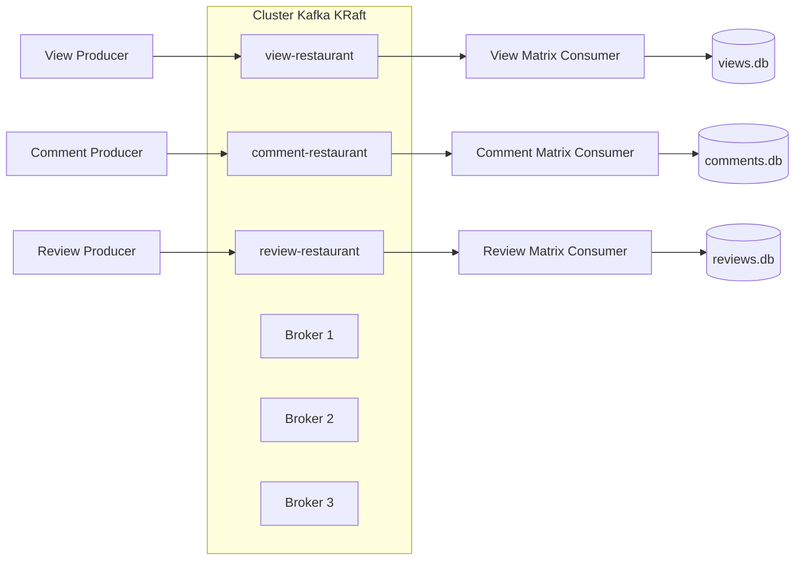

# 01 — Arquitetura

## Visão geral

Os três nós exercem os papéis de broker e controller. O modo KRaft elimina a dependência do ZooKeeper. O quorum tem três controllers; dois nós ativos bastam para eleger e manter o controller.

Cada tópico possui três partições, fator de replicação 3 e exige duas réplicas sincronizadas para aceitar uma gravação. A chave `user_id` mantém os eventos de um usuário na mesma partição. Os produtores usam `acks=all` e idempotência do cliente Kafka.

## Acesso

Aplicações dentro da rede Compose acessam `kafka-1:19092,kafka-2:19092,kafka-3:19092`. Aplicações executadas no host usam `localhost:29092,localhost:39092,localhost:49092`.

Os dados dos brokers ficam em volumes Docker. As matrizes usam bind mount em `kafka/data`, permitindo consulta direta e preservação após `docker compose down`.

## Limite desta etapa

Esta implementação termina nas matrizes de interação. Os modelos A, B e C e o ensemble representados em `kafka_architecture.png` serão desenvolvidos em outra etapa. A divisão mantém a primeira versão pequena, executável e verificável sem dataset ou infraestrutura de aprendizado de máquina.
