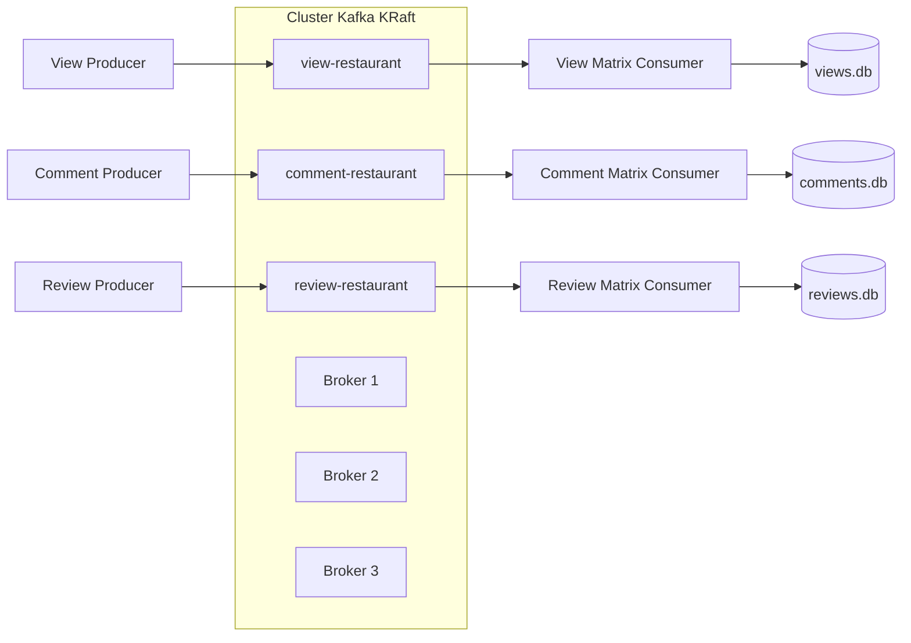

# 01 — Arquitetura

## Visão geral

```mermaid
flowchart LR
    VP[View Producer] --> VT[view-restaurant]
    CP[Comment Producer] --> CT[comment-restaurant]
    RP[Review Producer] --> RT[review-restaurant]

    subgraph K[Cluster Kafka KRaft]
        B1[Broker 1]
        B2[Broker 2]
        B3[Broker 3]
        VT
        CT
        RT
    end

    VT --> VC[View Matrix Consumer]
    CT --> CC[Comment Matrix Consumer]
    RT --> RC[Review Matrix Consumer]
    VC --> VD[(views.db)]
    CC --> CD[(comments.db)]
    RC --> RD[(reviews.db)]
```

Os três nós exercem os papéis de broker e controller. O modo KRaft elimina a dependência do ZooKeeper. O quorum tem três controllers; dois nós ativos bastam para eleger e manter o controller.

Cada tópico possui três partições, fator de replicação 3 e exige duas réplicas sincronizadas para aceitar uma gravação. A chave `user_id` mantém os eventos de um usuário na mesma partição. Os produtores usam `acks=all` e idempotência do cliente Kafka.

## Acesso

Aplicações dentro da rede Compose acessam `kafka-1:19092,kafka-2:19092,kafka-3:19092`. Aplicações executadas no host usam `localhost:29092,localhost:39092,localhost:49092`.

Os dados dos brokers ficam em volumes Docker. As matrizes usam bind mount em `kafka/data`, permitindo consulta direta e preservação após `docker compose down`.

## Integração com treinamento

O Compose da raiz usa os mesmos consumidores e tópicos para preencher bancos isolados em `kafka/data/yelp`. O treinamento lê essas matrizes, treina três modelos e publica um aviso de promoção. Os produtores sintéticos deste diretório continuam disponíveis no perfil `synthetic`.
